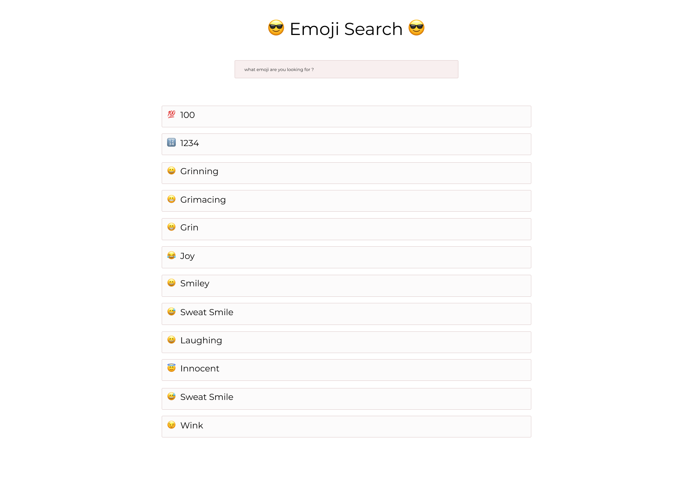
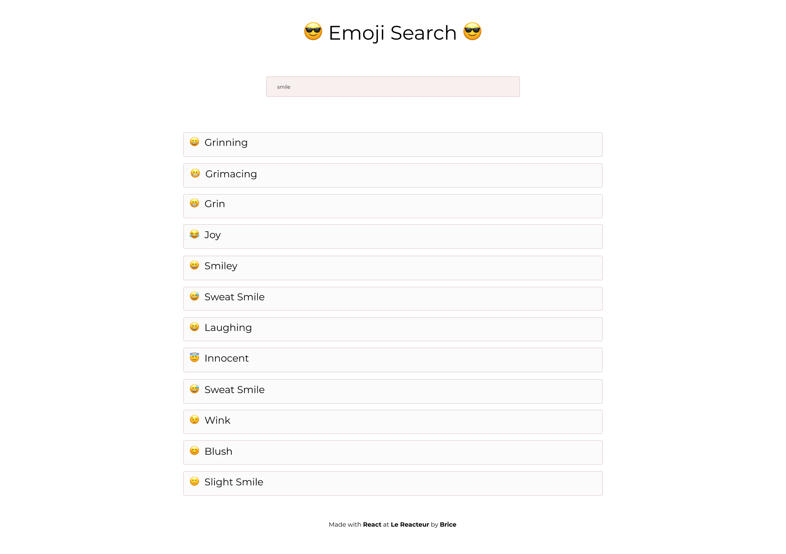
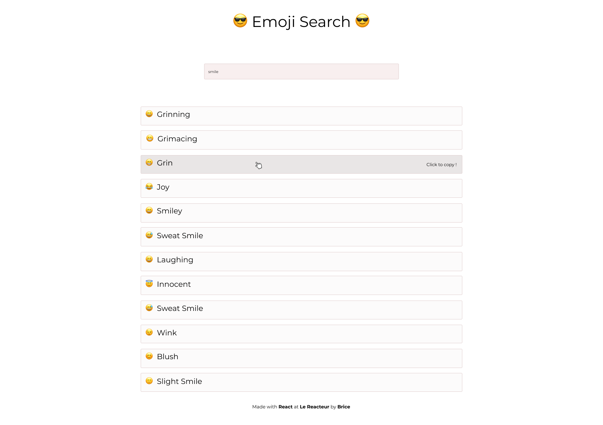

# EmojiSearch

Site déployé ➡️ [Emoji Search](https://antancelin-emoji-search.netlify.app)

Afin de déclencher une véritable avalanche de 👍 et de 😂 lors de vos prochains posts sur Slack, vous décidez, pour gagner du temps, de créer
un moteur de recherche d'emoji.

 

 

Il vous faudra créer :

- un composant **'Search'** qui regroupera le titre du site ainsi que l' **'input'** de recherche
- un composant **'Line'** : chaque ligne de résultat
- un composant **'Footer'** dans lequel figureront les crédits

Vous aurez besoin du JSON [suivant](https://res.cloudinary.com/lereacteur-apollo/raw/upload/v1604577176/react-new-exercices/EmojiSearch/emojiList_mar8cs.json).

Référez-vous à l'exemple [suivant](https://lereacteur-react-emoji-search.netlify.app/).

## Bonus

- le projet crée devra être **'responsive'**.
- il faudra pouvoir copier l'emoji en cliquant sur la ligne correspondante.
